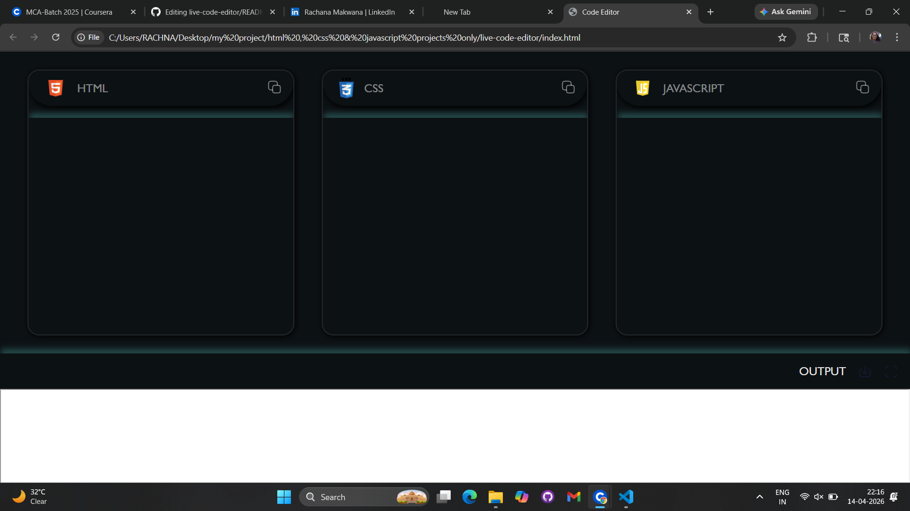
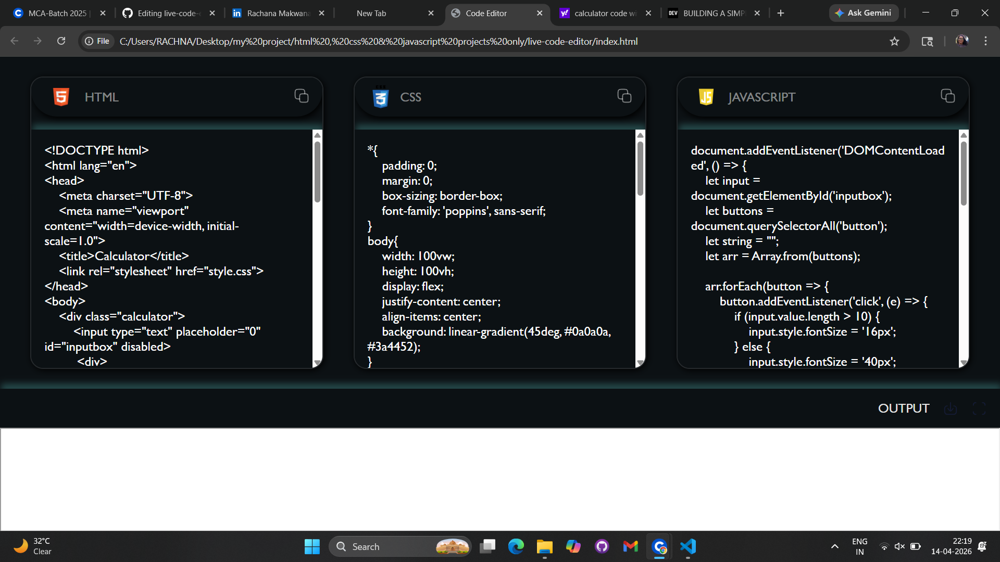
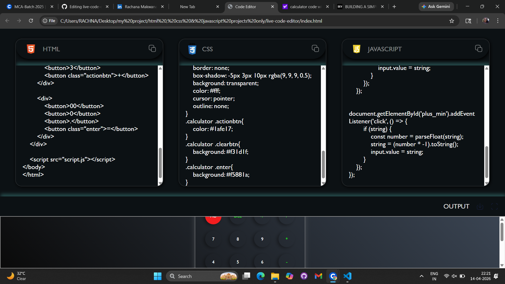
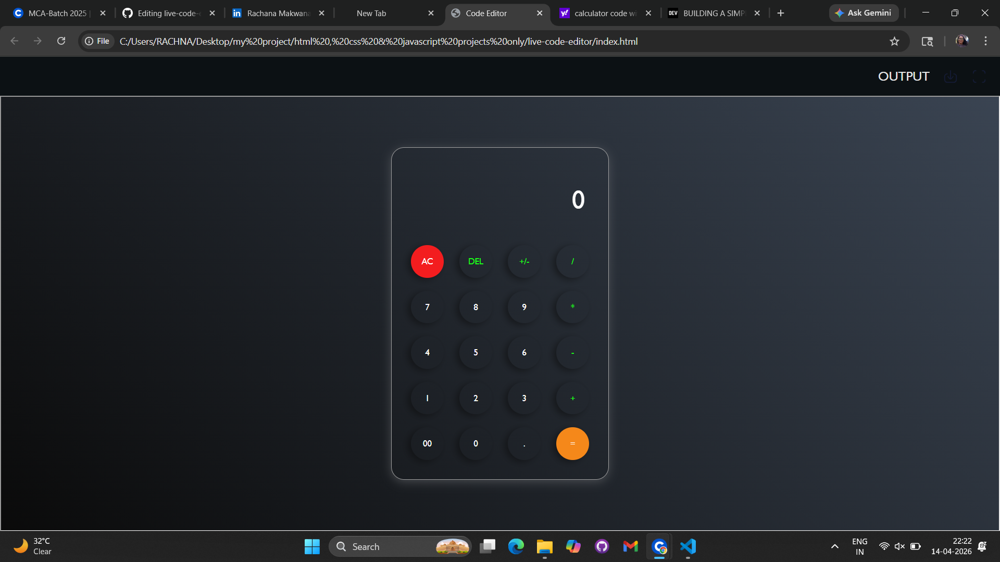

# 💻 Live Code Editor

🔗 Live Demo: https://rachana0106.github.io/live-code-editor/

---

## 📌 Overview
A simple live code editor that allows users to write HTML, CSS, and JavaScript and see the output instantly.

---

## 🚀 Features
- Live preview of code output
- Separate editors for HTML, CSS, and JavaScript
- Copy code functionality
- Fullscreen output mode
- Clean and interactive UI

---

## 🛠 Tech Stack
- HTML5
- CSS3
- JavaScript

---

## 📸 Screenshots

---

## 📚 What I Learned
- DOM manipulation
- iframe usage
- Event handling
- Building interactive UI

---

## 🔗 Connect with Me
https://www.linkedin.com/in/rachanamakwana/
